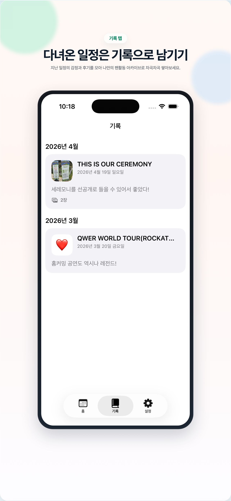
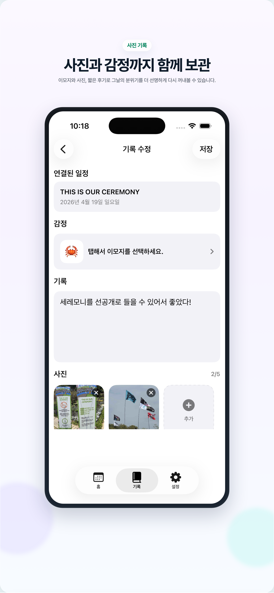
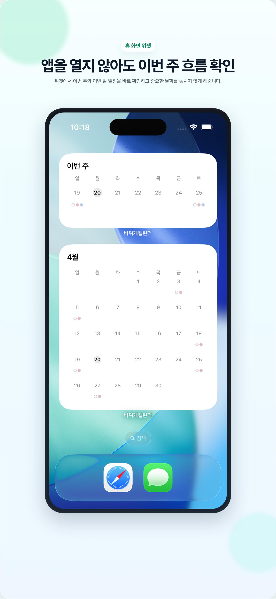

# RockCrabCalendar

> 바위게들을 위한 팬덤 캘린더 앱 🎶  
> 공식 일정 + 개인 일정 + 일정 기록을 한 곳에서<br>
> 팬활동의 계획과 추억을 함께 관리하세요.

---

## 📸 스크린샷
<p align="center">
  
  
  
  
  
  
</p>

---

## 🚀 핵심 기능

- QWER 공식 일정과 사용자가 직접 추가한 일정을 한 화면에서 관리
- 캘린더/리스트 보기, 검색, 카테고리 필터로 일정 빠르게 탐색
- 일정별 알림 시간 설정 지원 (`1시간 전`, `30분 전`, `10분 전`, `5분 전`)
- 기록 탭에서 일정별 감정, 회고, 사진 최대 5장 저장
- 기록 카드, 상세/수정, 사진 프리뷰, 기록 삭제 시 첨부 사진 정리 지원
- 홈 화면 위젯으로 이번 주와 이번 달 일정 확인
- 앱/위젯 영어 UI와 앱 내부 언어 설정 제공
- iPhone 및 iPad 화면 지원

---

## 🛠 설치 & 사용법

1. 앱스토어에서 `바위게캘린더` 검색 → 설치  
2. 앱 내 필터 & 오늘 버튼으로 빠른 이동 가능  
3. 일정 추가: 화면 하단 “+” 버튼 또는 일정 리스트에서 “추가”  
4. 알림 설정: 일정 추가/수정 화면에서 `시작 전에 알림 받기`를 켜고 알림 시간을 선택
5. 기록 남기기: 일정 카드의 기록 버튼 또는 기록 탭에서 감정, 회고, 사진을 저장
6. 언어 설정: 설정 → `앱 언어`에서 `시스템 설정 사용 / 한국어 / English` 선택 가능

> 🧰 개발자용 설정  
> - 기반: iOS 17 / SwiftUI  
> - GitHub 저장소 클론:  
>   ```bash
>   git clone https://github.com/YuSeongChoi/RockCrabCalendar.git
>   cd RockCrabCalendar
>   make open
>   ```
> - CLI 빌드/테스트:
>   ```bash
>   make build
>   # 1) 모듈 테스트(권장/CI 1차 게이트)
>   make test-modules
>   # 2) 앱 유닛 테스트
>   make test-app
>   # 필요 시
>   make test-ui
>   make test-all
>   ```
> - 시뮬레이터 변경 예시:
>   ```bash
>   make test-app DESTINATION='platform=iOS Simulator,name=iPhone 17,OS=latest'
>   ```
> - 아키텍처 개요: `RockCrabCalendar/ARCHITECTURE.md`
> - 광고 수익화 운영 체크리스트: `docs/ad-monetization-checklist.md`

---

## 📬 사용자 지원 & 버그 제보

앱 사용 중 문제나 제안하고 싶은 기능이 있으면 아래 방법을 활용해주세요:

- 📧 이메일: `marine8743@naver.com`  
- 🐛 버그 제보 / 기능 요청: [GitHub Issues](https://github.com/YuSeongChoi/RockCrabCalendar/issues)  
- 📱 보내실 때 포함해 주세요:  
  - 기기(예: iPhone 17, iPad Pro)  
  - iOS 버전  
  - 앱 버전  
  - 발생 화면 스크린샷 및 재현 방법

---

## 🛤 개발 로드맵 (예정 기능)

| 기능 | 상태 |
|---|------|
| 기록 공유 기능 | 계획 중 |
| 기록 검색 및 감정별 필터 | 계획 중 |
| 캘린더형 기록 아카이브 | 아이디어 수렴 중 |
| 사진 순서 변경 및 대표 사진 설정 | 아이디어 수렴 중 |

---
## 🐍 업데이트 내역
2026.04.22 업데이트 내역(v2.0.0)

1. 기록 탭을 추가해 일정별 감정, 회고, 사진을 남길 수 있어요
2. 기록 사진은 최대 5장까지 추가하고 크게 볼 수 있어요
3. 일정별 알림 시간을 `1시간 전`, `30분 전`, `10분 전`, `5분 전` 중 선택할 수 있어요
4. 홈 화면에서 일정 검색을 지원해 원하는 일정을 빠르게 찾을 수 있어요
5. iPhone/iPad 앱스토어 제출용 스크린샷을 최신 UI 기준으로 정리했어요

2026.03.18 업데이트 내역(v1.1.8)

1. 앱 내부 언어 설정을 추가했어요
2. 앱과 위젯에서 영어 UI를 더 자연스럽게 다듬었어요
3. 영어 환경에서 QWER 일정 시간에 `KST`를 표시하도록 개선했어요
4. 위젯 미리보기와 영어 앱 이름 표기를 정리했어요

2025.12.02 업데이트 내역(v1.1.2)

1. 일정 시간 로직을 변경했어요!
2. 성공적인 미국 ROCKATION 투어를 축하해요!

2025.10.16 업데이트 내역(v1.1.1)

1. 이제 사용자가 직접 일정을 추가할 수 있어요!
2. 추가된 일정이 시간순서로 정렬되도록 했어요!
3. 개발자가 단독 콘서트 후유증에 빠져버렸어요!
4. 2주년 팝업 구매목록을 작성하고 있어요
---

## 💡 왜 바위게캘린더인가?

팬으로서 일정 놓치는 것이 아쉬웠던 순간들을 기억해요.  
공식 일정, 내 일정, 다녀온 일정의 기록이 분리되어 있었기에 모든 걸 한 곳에 보고 싶었고, 그래서 만든 앱입니다.<br>
“바위게들의 하루”를 조금 더 특별하게 만드는 작은 도구가 되길 바랍니다.

---

## 📄 라이선스 & 저작권

© 2026 YuSeong Choi<br>
라이선스: MIT License
