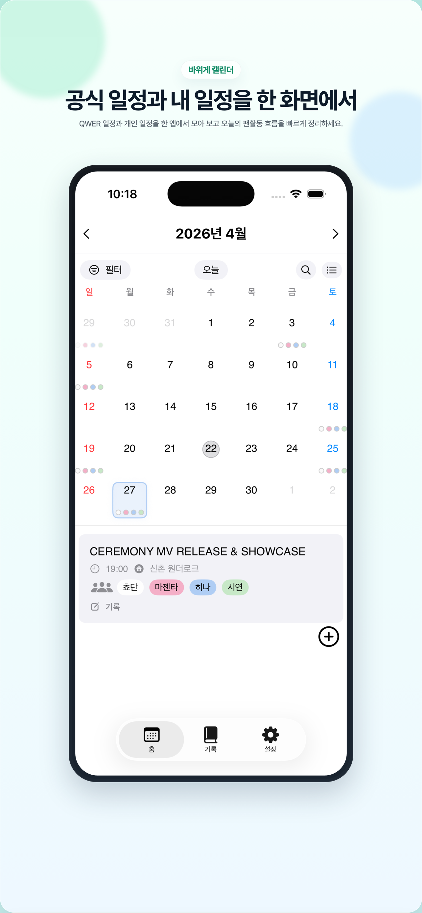
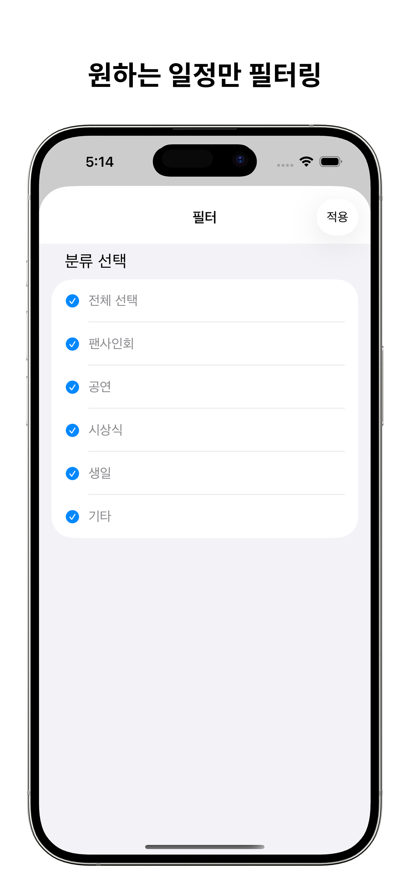
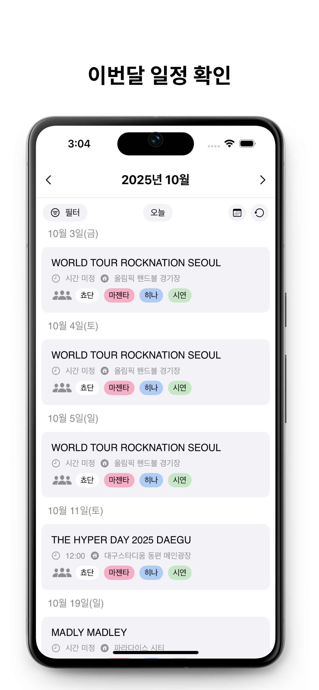
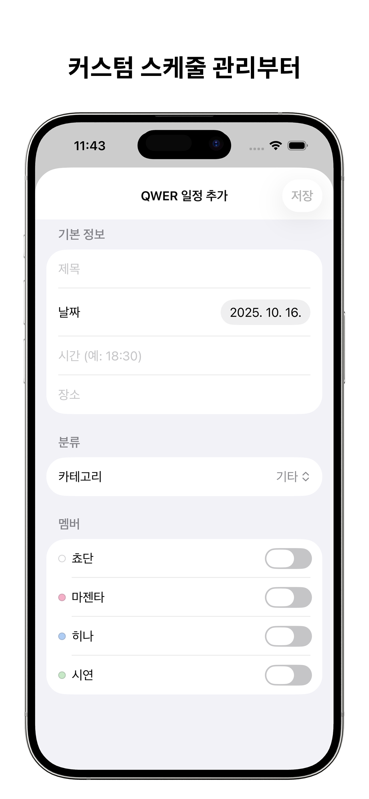
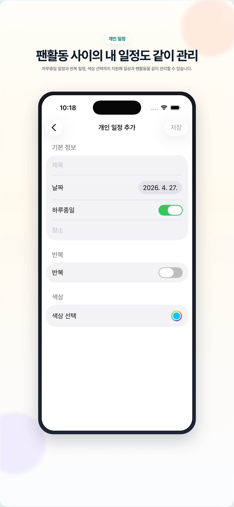

# RockCrabCalendar

> 바위게들을 위한 팬덤 캘린더 앱 🎶  
> 공식 일정 + 내가 추가한 일정 + 멤버별 태그로  
> 팬활동을 더 쉽고 즐겁게 관리하세요.

---

## 📸 스크린샷
<p align="center">
  
  
  
  
  
  
</p>

---

## 🚀 핵심 기능

- QWER 일정 업데이트 (생일, 팬사인회, 개인 일정 등)
- 사용자 개인 일정 추가 가능 
- 멤버별 색상 태그로 멤버별 참여자 시각화 
- 깔끔하고 감성 있는 디자인, 간편한 UI  
- iPad 가로/세로/다양한 화면 크기 지원

---

## 🛠 설치 & 사용법

1. 앱스토어에서 `바위게캘린더` 검색 → 설치  
2. 앱 내 필터 & 오늘 버튼으로 빠른 이동 가능  
3. 일정 추가: 화면 하단 “+” 버튼 또는 일정 리스트에서 “추가”  
4. 멤버 색상 설정: 설정 → 멤버 탭에서 색 변경  

> 🧰 개발자용 설정  
> - 기반: iOS 17 / SwiftUI  
> - GitHub 저장소 클론:  
>   ```bash
>   git clone https://github.com/YuSeongChoi/RockCrabCalendar.git
>   cd RockCrabCalendar
>   make open
>   ```
> - CLI 빌드/테스트:
>   ```bash
>   make build
>   # 1) 모듈 테스트(권장/CI 1차 게이트)
>   make test-modules
>   # 2) 앱 유닛 테스트
>   make test-app
>   # 필요 시
>   make test-ui
>   make test-all
>   ```
> - 시뮬레이터 변경 예시:
>   ```bash
>   make test-app DESTINATION='platform=iOS Simulator,name=iPhone 17,OS=latest'
>   ```
> - 아키텍처 개요: `RockCrabCalendar/ARCHITECTURE.md`

---

## 📬 사용자 지원 & 버그 제보

앱 사용 중 문제나 제안하고 싶은 기능이 있으면 아래 방법을 활용해주세요:

- 📧 이메일: `marine8743@naver.com`  
- 🐛 버그 제보 / 기능 요청: [GitHub Issues](https://github.com/YuSeongChoi/RockCrabCalendar/issues)  
- 📱 보내실 때 포함해 주세요:  
  - 기기(예: iPhone 17, iPad Pro)  
  - iOS 버전  
  - 앱 버전  
  - 발생 화면 스크린샷 및 재현 방법

---

## 🛤 개발 로드맵 (예정 기능)

| 기능 | 상태 |
|---|------|
| 팬 후기 공유 기능 | 계획 중 |
| 이미지/스티커 저장 아카이브 | 계획 중 |
| - 할 일(To-Do) 기능 및 알림 설정  | 걔획 중 |
| 커뮤니티 탭 / 다른 팬들과 일정 공유 | 아이디어 수렴 중 |

---
## 🐍 업데이트 내역
2025.10.16 업데이트 내역(v1.1.1)

1. 이제 사용자가 직접 일정을 추가할 수 있어요!
2. 추가된 일정이 시간순서로 정렬되도록 했어요!
3. 개발자가 단독 콘서트 후유증에 빠져버렸어요!
4. 2주년 팝업 구매목록을 작성하고 있어요

2025.12.02 업데이트 내약(v1.1.2)

1. 일정 시간 로직을 변경했어요!
2. 성공적인 미국 ROCKATION 투어를 축하해요!
---

## 💡 왜 바위게캘린더인가?

팬으로서 일정 놓치는 것이 아쉬웠던 순간들을 기억해요.  
내 멤버 스케줄, 내 일정, 공식 일정이 분리되어 있었기에 모든 걸 한 곳에 보고 싶었고, 그래서 만든 앱입니다.  
“바위게들의 하루”를 조금 더 특별하게 만드는 작은 도구가 되길 바랍니다.

---

## 📄 라이선스 & 저작권

© 2025 YuSeong Choi  
라이선스: MIT License
